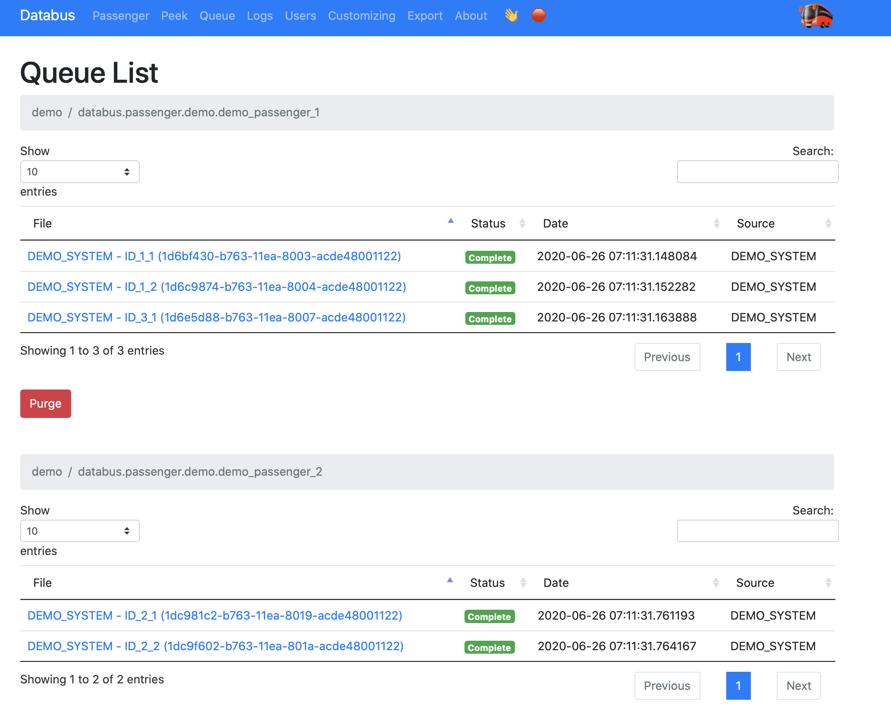

# Databus
This project is an asynchronous data integration platform. It can pull, queue, process and push data within the defined rules. 

**Detailed documentation can be found at [https://keremkoseoglu.github.io/databus/](https://keremkoseoglu.github.io/databus/).**

